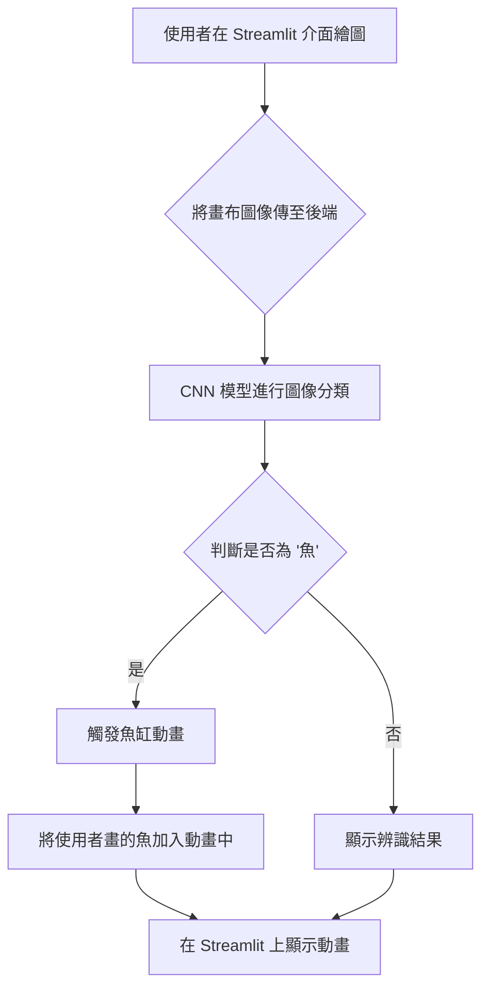

# 互動式繪圖辨識與動畫專案

這是一個結合深度學習、電腦視覺與互動式網頁應用的專案。使用者可以在網頁上繪製塗鴉，後端的人工智慧模型會即時辨識繪製的內容。如果辨識結果為「魚」，系統就會將使用者繪製的圖案動態地加入一個虛擬魚缸動畫中。

## 專案架構

本專案的運作流程如下：



## 安裝方式

1.  **複製專案**
    ```bash
    git clone <your-repository-url>
    cd <repository-name>
    ```

2.  **建立虛擬環境 (建議)**
    ```bash
    python -m venv venv
    source venv/bin/activate  # Windows: venv\Scripts\activate
    ```

3.  **安裝相依套件**
    本專案所需的套件已列於 `requirements.txt`。請執行以下指令進行安裝：
    ```bash
    pip install -r requirements.txt
    ```

## 如何執行

確認所有套件都已安裝後，在專案根目錄下執行以下指令即可啟動應用程式：

```bash
streamlit run app.py
```
接著瀏覽器將會自動開啟並導向至應用程式頁面。

## 如何部署至 Streamlit Cloud

1.  **將專案上傳至 GitHub**
    請確認您的 GitHub 儲存庫包含以下檔案：
    - `app.py`
    - `fish_classifier.h5`
    - `cat.npy`
    - `fish.npy`
    - `fish_animation.py`
    - `model.py`
    - `utils.py`
    - `requirements.txt`

2.  **登入 Streamlit Cloud**
    使用您的 GitHub 帳號登入 [Streamlit Cloud](https://share.streamlit.io/)。

3.  **建立新應用**
    - 點擊 "New app"。
    - 選擇您剛剛上傳的 GitHub 儲存庫。
    - 確認 `Main file path` 指向 `app.py`。
    - 點擊 "Deploy!" 按鈕。

    Streamlit Cloud 會自動根據 `requirements.txt` 安裝相依套件並部署您的應用程式。

## 成果截圖

您可以在下方看到此應用程式的執行成果。


*(請將 `images/screenshot.png` 替換為您的實際截圖路徑)*

## 致謝

本專案的卷積神經網路（CNN）模型建構與訓練流程，修改自 **蔡炎龍 (Yen-Lung Tsai) 教授** 的 AI-Demo 範例。

- **原始參考資料**: [【Demo02】遷移式學習做八哥辨識器.ipynb](https://github.com/yenlung/AI-Demo/blob/master/【Demo02】遷移式學習做八哥辨識器.ipynb)

特此感謝蔡教授提供的寶貴教材。
