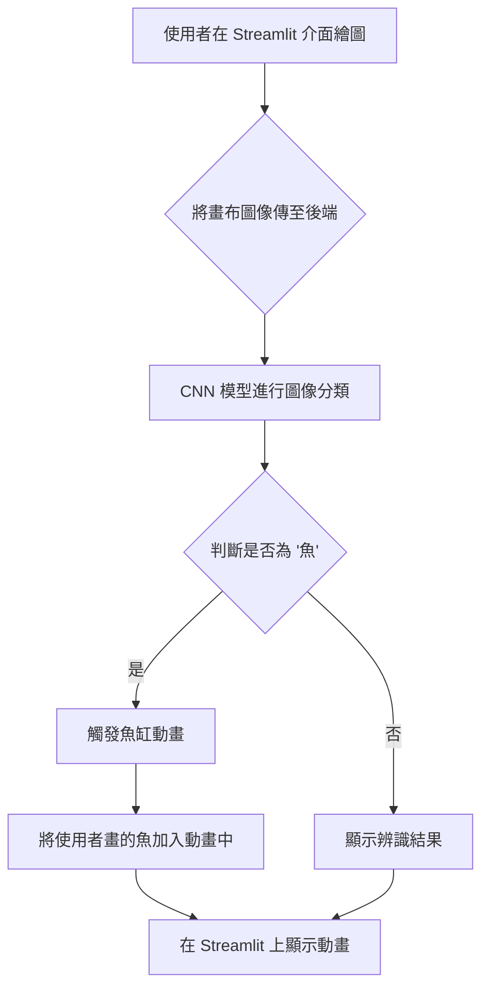

# 互動式 AI 魚缸：畫魚成真！

[](https://5114056012hw4.streamlit.app/)

這是一個結合深度學習、電腦視覺與互動式網頁應用的專案。使用者可以在網頁上自由繪製塗鴉，後端的人工智慧模型會即時辨識。如果辨識結果為「魚」，系統便會將使用者親手畫的圖案轉化為一條活生生的魚，動態地加入虛擬魚缸動畫中，與其他魚群一同悠游。

## 專案架構

本專案的運作流程如下：



## 安裝與執行

請依照以下步驟在您的本機環境安裝並執行此專案。

### 1. 前置需求：安裝 Git LFS

本專案使用 Git LFS (Large File Storage) 來管理大型檔案（例如 `.h5` 模型檔）。請務必先從官方網站下載並安裝 Git LFS：
[https://git-lfs.github.com](https://git-lfs.github.com)

安裝後，執行一次以下指令來初始化 Git LFS：
```bash
git lfs install
```

### 2. 複製並進入專案

```bash
git clone <your-repository-url>
cd 5114056012_HW4
```

### 3. 下載大型檔案

進入專案目錄後，執行以下指令來下載由 Git LFS 管理的模型檔案：
```bash
git lfs pull
```
成功後，您應該會看到 `fish_classifier.h5` 等檔案出現在目錄中。

### 4. 安裝相依套件

建議先建立虛擬環境，再安裝 `requirements.txt` 中列出的所有套件。
```bash
# 建立虛擬環境 (建議)
python -m venv venv
# 啟用虛擬環境 (Windows)
venv\Scripts\activate
# (macOS/Linux)
# source venv/bin/activate

# 安裝套件
pip install -r requirements.txt
```

### 5. 執行應用程式

確認所有步驟完成後，執行以下指令即可啟動 Streamlit 應用程式：
```bash
streamlit run app.py
```
瀏覽器將會自動開啟，並帶您前往互動魚缸的頁面。

### 疑難排解：模型載入失敗

如果在執行時遇到關於 `fish_classifier.h5` 的錯誤，或模型載入失敗，您可以執行以下指令來重新訓練並產生新的模型檔案：
```bash
python model.py
```
完成後，請再次嘗試執行 `streamlit run app.py`。

## 如何部署至 Streamlit Cloud

1.  **將專案上傳至 GitHub**
    請確認您的 GitHub 儲存庫已啟用 Git LFS，並包含以下檔案：
    - `app.py`
    - `fish_classifier.h5` (應由 LFS 管理)
    - `cat.npy` (應由 LFS 管理)
    - `fish.npy` (應由 LFS 管理)
    - `fish_animation.py`
    - `model.py`
    - `app_utils.py` (原 `utils.py`)
    - `requirements.txt`
    - `.gitattributes` (LFS 設定檔)

2.  **登入 Streamlit Cloud**
    使用您的 GitHub 帳號登入 [Streamlit Cloud](https://share.streamlit.io/)。

3.  **建立新應用**
    - 點擊 "New app"。
    - 選擇您剛剛上傳的 GitHub 儲存庫。
    - 確認 `Main file path` 指向 `app.py`。
    - 點擊 "Deploy!" 按鈕。

    Streamlit Cloud 會自動處理 `requirements.txt` 並部署您的應用程式。

## 成果截圖

您可以在下方看到此應用程式的執行成果。


*(請將 `images/screenshot.png` 替換為您的實際截圖路徑)*

## 致謝

本專案的卷積神經網路（CNN）模型建構與訓練流程，修改自 **蔡炎龍 (Yen-Lung Tsai) 教授** 的 AI-Demo 範例。

- **原始參考資料**: [【Demo02】遷移式學習做八哥辨識器.ipynb](https://github.com/yenlung/AI-Demo/blob/master/【Demo02】遷移式學習做八哥辨識器.ipynb)

特此感謝蔡教授提供的寶貴教材。